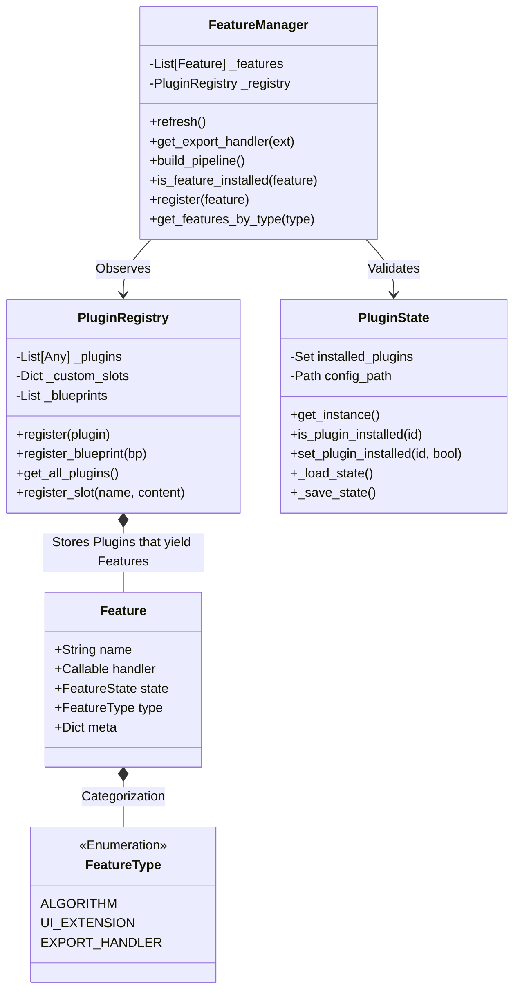
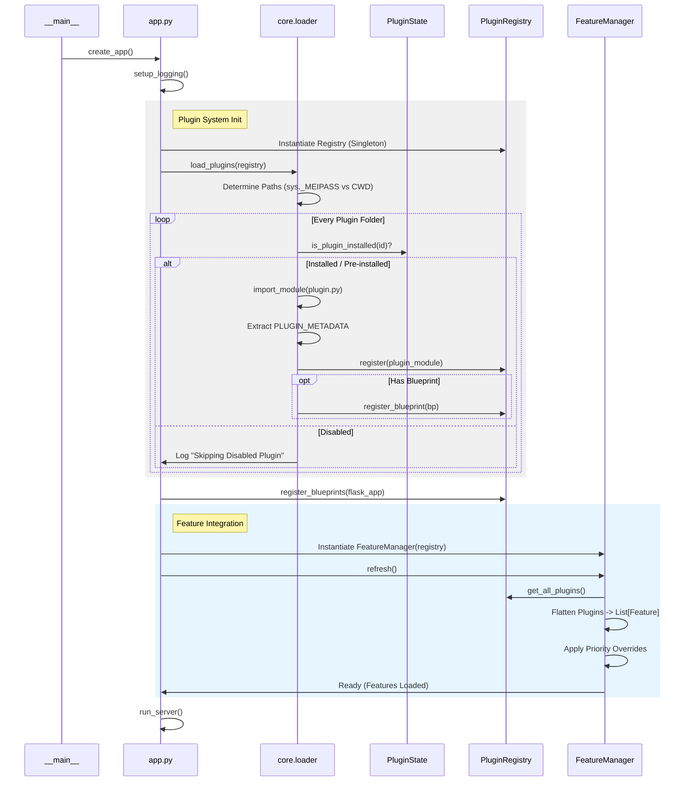
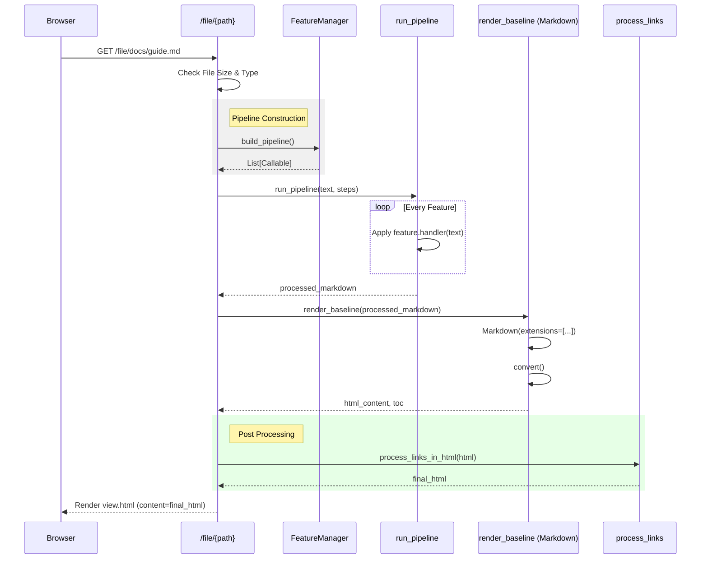
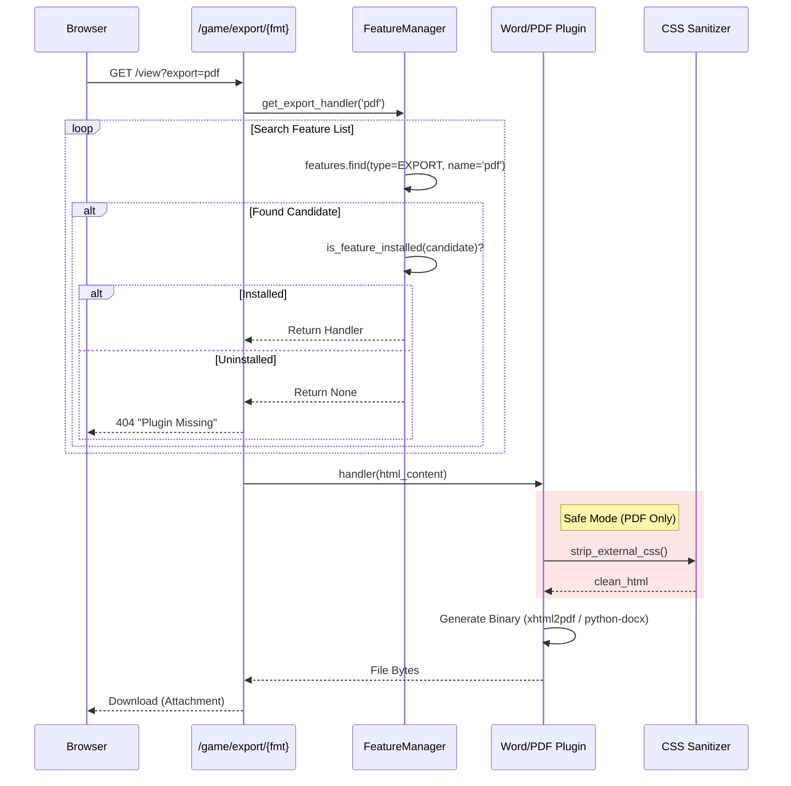
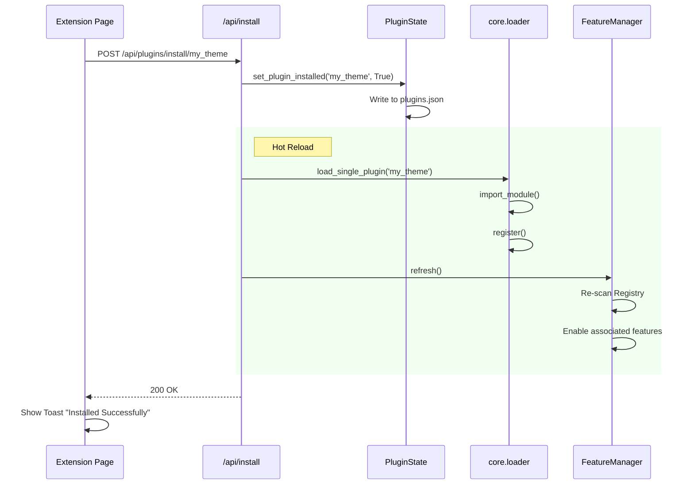

# DocNexus Architecture & Logic Flows

This document provides a deep dive into the internal architecture, versioning logic, and data rendering flows of DocNexus v1.2.0+.

---

## 1. Functional Layout (Block Design)

The application consists of three primary functional blocks: the **Input Processor**, the **Core Kernel**, and the **Output Generators**.

```mermaid
graph LR
    subgraph InputSources ["Block 1: Input Sources"]
        FS[Filesystem<br/>(.md Files)]
        Remote[Remote Sources<br/>(Future: S3/Git)]
        User[User Input<br/>(Editor/Settings)]
    end

    subgraph CoreKernel ["Block 2: Core Kernel"]
        Router[Flask Router<br/>(API/Views)]
        Loader[Module Loader<br/>(Discovery)]
        Registry[Feature Registry<br/>(Database)]
        Manager[Feature Facade<br/>(Logic)]
        Pipeline[Render Pipeline<br/>(Execution Chain)]
    end

    subgraph OutputEngines ["Block 3: Output Engines"]
        HTML[Web Engine<br/>(Jinja2 + Theme)]
        PDF[PDF Engine<br/>(xhtml2pdf)]
        DOCX[Word Engine<br/>(python-docx)]
    end

    FS --> Router
    User --> Router
    Loader -->|Populates| Registry
    Registry -->|Feeds| Manager
    Manager -->|Configures| Pipeline
    Router -->|Triggers| Pipeline
    Pipeline -->|Content| HTML
    Pipeline -->|Content| PDF
    Pipeline -->|Content| DOCX
```

---

## 2. Low Level Architecture (Class Design)

The system relies on a strictly typed (checked at runtime) relationship between the **Manager**, **Registry**, and **Features**.



---

## 3. Detailed Logic Flows

### A. Application Startup (Deep Dive)
How the application initializes, handling both frozen (PyInstaller) and source environments.



### B. Document Rendering Pipeline
The core loop: transforming Markdown source into the HTML viewed by the user.



### C. Export Request Flow
The user clicks "Export to PDF". The system must locate the correct handler, ensure it's allowed, and execute it safe-mode.



### D. Extension Management Flow
User installs an extension via the Marketplace UI.



---

## 4. Versioning Architecture
We adhere to a **Single Source of Truth (SSOT)** robust versioning strategy.

### The Source of Truth
*   **File**: `docnexus/version_info.py`
*   **Content**: `__version__ = '1.2.x'`
*   **Role**: This is the *only* place the version number is hardcoded.
*   **Sync**: The root `VERSION` file is automatically updated from this source during build.

### The Propagation Flow
1.  **Package Init**: `docnexus/__init__.py` imports `__version__` from `version_info.py`.
2.  **Runtime App**: `docnexus/app.py` imports `docnexus.version_info` to populate the `VERSION` constant.
3.  **Build System**: `scripts/build.py` reads `version_info.py` directly from the filesystem to name the executable (e.g., `DocNexus_v1.2.0.exe`).
4.  **User Interface**: `app.py` injects `version` into the global Jinja2 template context.

---

## 5. Module Breakdown

### `docnexus.core`
The engine room.
*   `renderer.py`: Orchestrates the markdown-to-html conversion.
*   `loader.py`: Handles plugin discovery, dependency injection, and loading in both Dev and Frozen environments.
*   `state.py`: Manages the persistence of plugin states (Enabled/Disabled) via `plugins.json`.

### `docnexus.features`
The "Plugin" system for core features.
*   **Registry**: Singleton managing active features.
*   **FeatureManager**: The global access point (`FEATURES`) acting as a facade.
*   **Standard**: Baseline features (TOC, Headers).
*   **Smart**: Advanced AI/Regex features.

### `docnexus.plugins`
User-installable extensions isolated in their own packages.
*   **Bundled**: Essential plugins (Word Export, Auth) shipped with the exe.
*   **Dev**: Optional/Premium plugins.
