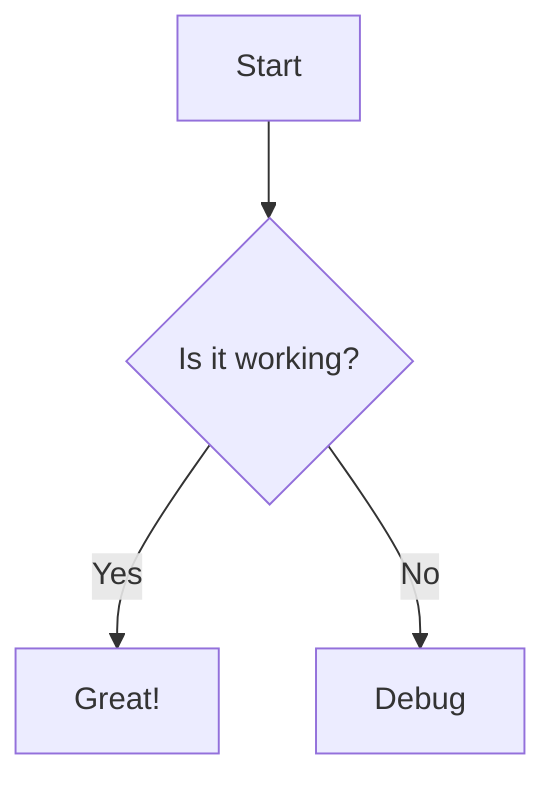
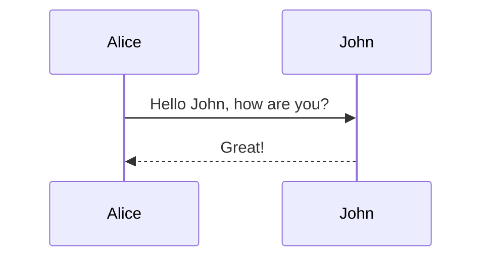

# DocNexus Feature Validation Suite
This document validates **ALL** Markdown features currently supported by the DocNexus renderer (v1.2.6).

[TOC]

## 1. New Features (v1.2.6)
### 1.1 GitHub Alerts
> [!NOTE]
> This is a **Note** alert.

> [!TIP]
> This is a **Tip** alert.

> [!IMPORTANT]
> This is an **Important** alert.

> [!WARNING]
> This is a **Warning** alert.

> [!CAUTION]
> This is a **Caution** alert.

### 1.2 WikiLinks
Link to an internal page: [[feature_test_v1.2.6]]

### 1.3 CriticMarkup (Review)
- Addition: {++Added++}
- Deletion: {--Deleted--}
- Substitution: {~~Old~>New~~}
- Comment: {>>Comment<<}
- Highlight: {==Marked==}{>>With Comment<<}

### 1.4 Smarty & Emoji
- **Smart Punctuation**: "Smart Quotes", -- En-dash, --- Em-dash, ... Ellipsis.
- **Emoji**: :rocket: :tada: :snake: :heart:

---

## 2. Standard Extended Features
### 2.1 Tabbed Interface
=== "Python"
    ```python
    def hello():
        print("Hello World")
    ```
=== "JavaScript"
    ```javascript
    console.log("Hello World");
    ```

### 2.2 Collapsible Details
??? note "Click to Expand"
    Here is some hidden content!
    It supports **multiline** text.

### 2.3 Math (Arithmatex)
- Inline: $E=mc^2$
- Block:

$$
\frac{n!}{k!(n-k)!} = \binom{n}{k}
$$

### 2.4 Task Lists
- [x] Completed task
- [ ] Incomplete task
- [ ] Working on it

### 2.5 Keyboard Keys
To save, press ++ctrl+s++ or ++cmd+s++.

### 2.6 Highlights & formatting
- Mark: ==Highlighted Text==
- Insert: ++Inserted Text++
- Delete: ~~Strikethrough~~
- Subscript: H~2~O
- Superscript: X^2^

### 2.7 Definition Lists
Term 1
:   Definition 1

Term 2
:   Definition 2a
:   Definition 2b

### 2.8 Footnotes
Here is a footnote reference.[^1]

[^1]: This is the footnote content.

### 2.9 Abbreviations
The HTML specification is maintained by the W3C.

*[HTML]: Hyper Text Markup Language
*[W3C]: World Wide Web Consortium

### 2.10 Attributes
This paragraph has a custom class.
{: .custom-class #custom-id style="color: red;"}

---

## 3. Diagrams (Mermaid)




---

## 4. Standard Tables
| Item      | Value | Qty  |
| :-------- | :---: | ---: |
| Computer  | $1600 |    5 |
| Phone     |   $12 |   12 |
| Pipe      |    $1 |  234 |

## 5. Magic Links
- Auto-link: https://google.com
- Mailto: contact@example.com
